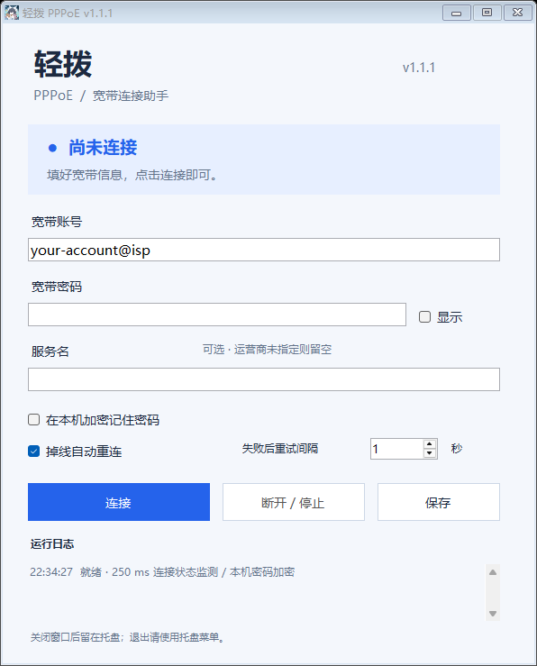

# 轻拨 PPPoE

~~到底哪些大学校园网还在让电脑直拨PPPoE啊！不会是广西某211吧~~

适用于 Windows 10 / 11 的中文 GUI 宽带拨号工具。使用 Windows RAS / PPPoE 协议栈，无第三方依赖、无需安装驱动。附带可运行程序和完整 C# 源码。



## 开始使用

1. 从 [Releases](https://github.com/SakuraChanNya/QuickPPPoE/releases/latest) 下载 `QuickPPPoE-v1.1.1.exe`，双击即可。
2. 输入运营商提供的宽带账号和密码。
3. 如运营商指定了 **服务名（service-name）**，在“服务名”框中原样填写，区分大小写；没有指定则留空。
4. 保持“掉线自动重连”勾选，点击“连接”。
5. 点击“断开 / 停止”会取消当前拨号、断开本程序连接并停止重试。

需要电脑通过以太网接入能提供 PPPoE 的设备，例如处于桥接模式的光猫。如果路由器已负责拨号，电脑通常无需再次拨号。本程序不修改光猫或路由器配置。

系统需要 .NET Framework 4.8，现代 Windows 10 / 11 通常已自带；这里使用的是系统 Framework，不需要额外安装 .NET 6 SDK。程序以当前用户运行。

当前正式版为 `v1.1.1`。发布文件 `QuickPPPoE-v1.1.1.exe` 的 SHA-256：

```text
fe2d5a74291bb20db83b66fc01dcb99c293fb84de30e0f892bb5a26811cdc36c
```

可在 PowerShell 中运行 `Get-FileHash .\QuickPPPoE-v1.1.1.exe -Algorithm SHA256` 核对下载文件。

## 自动重连的行为

- 每 **250 毫秒**检查一次本程序的 RAS 连接状态。
- 已连接后掉线：立即开始清理旧连接，系统释放完成后自动发起下一次拨号；通常在随后 1–2 个检测周期内发起。
- 普通拨号失败：按界面的间隔重试，默认 **1 秒**，可调为 1–60 秒。间隔和系统释放等待会重叠，只有两者都满足才重拨。
- 单次拨号超过 60 秒会取消，释放完成后按重试设置继续。
- 账号、密码、账号状态等明确需要处理的错误会暂停重试，并在日志说明。
- 手动停止后不会自行重拨。取消勾选自动重连后，当前正常连接会保留，但掉线后不再重试。
- 关闭窗口或最小化后，程序在系统托盘继续运行。右键托盘 → “退出并断开”结束程序。
- 同一用户会话只运行一个实例；再次打开时会提示从托盘进入。

## 配置与密码

- 点击“连接”会先保存配置；也可以单独点击“保存”。运行中账号、密码和 service-name 锁定，停止后可修改。
- 默认不保存密码。勾选“在本机加密记住密码”后，使用 Windows DPAPI 的当前用户范围保护密码。
- 密码不会放入命令行、运行日志或明文配置。自动重连期间密码仍需保留在进程内存中。
- 取消勾选记住密码会立即清除已保存的密码密文。
- 如果 Windows 用户加密服务不可用，取消“记住密码”后可继续拨号；不会降级为明文保存。
- 配置目录：`%LOCALAPPDATA%\QuickPPPoE`。`settings.xml` 保存选项和可选的密码密文，`connections.pbk` 是程序独立使用的拨号簿。
- 程序不会改写默认拨号簿中的宽带连接。已存在的其他拨号连接仍可能占用同一 PPPoE 端口；使用前请自行断开会冲突的连接。
- 卸载时先从托盘退出，再删除程序目录。如需清除账号配置，同时删除上述当前用户配置目录。

## Service-name 实现

程序通过 `RasSetEntryPropertiesW` 创建宽带连接，设置：

- `RASENTRY.dwType = RASET_Broadband`
- `RASENTRY.szDeviceType = PPPoE`
- `RASENTRY.szLocalPhoneNumber = 用户输入的 service-name`

设备名称通过 `RasEnumDevicesW` 查找。该 service-name 字段参与实际拨号，支持留空，遵循 Windows API 的 128 字符长度限制。拨号使用 `RasDialW` 异步模式，界面线程负责状态检测和取消。默认协商 IPv4 和 IPv6，地址、DNS 由 Windows 自动配置，并启用两种协议的远程默认网关。

双栈无需选择或额外输入。运营商只提供 IPv4 时，连接可通过 IPv4 正常使用；程序不会检查“两种协议必须同时可用”，也不会因为没有 IPv6 地址而弹窗、报错或重拨。只有真实拨号或链路失败才沿用原有错误处理。IPv6 的实际互联网连通性取决于运营商提供的地址、路由及 DNS；程序不创建 IPv6 隧道或虚构地址。

配置依据：[Microsoft RASENTRY 文档](https://learn.microsoft.com/en-us/previous-versions/windows/desktop/legacy/aa377274(v=vs.85)) 中的 `dwfNetProtocols` 和 `RASEO2_IPv6RemoteDefaultGateway`。

接口依据：[微软 PPPoE 连接文档](https://learn.microsoft.com/en-us/windows/win32/rras/point-to-point-protocol-over-ethernet-connections)、[RasDialW 文档](https://learn.microsoft.com/en-us/windows/win32/api/ras/nf-ras-rasdialw)。

## 常见问题

| 现象 | 处理方式 |
| --- | --- |
| 错误 691 或账号认证失败 | 核对账号后缀、密码、欠费或运营商并发连接限制，修改后手动再连接。 |
| 错误 651、678 或连接超时 | 检查网线、光猫桥接、service-name 和运营商链路。 |
| 找不到 PPPoE 设备 | 检查 Windows 的 WAN Miniport (PPPOE) 和远程访问相关系统组件。 |
| 一直在“释放连接” | Windows 尚未释放旧拨号句柄，程序会继续等待以避免重复拨号；检查系统网络服务状态。 |
| 保存的密码无法解密 | 当前 Windows 用户环境可能变化，重新输入密码并保存，或取消记住密码。 |

日志仅保留在界面内，不写长期日志文件，不包含输入的密码。

## 许可证

本项目采用 [GNU General Public License v3.0](LICENSE) 开源。
